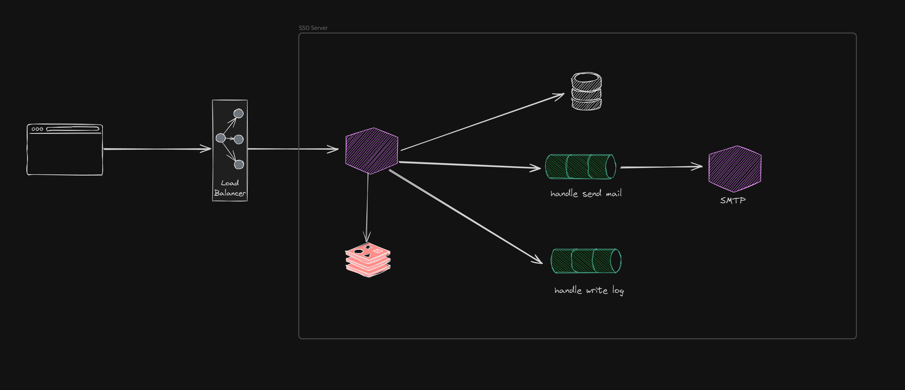
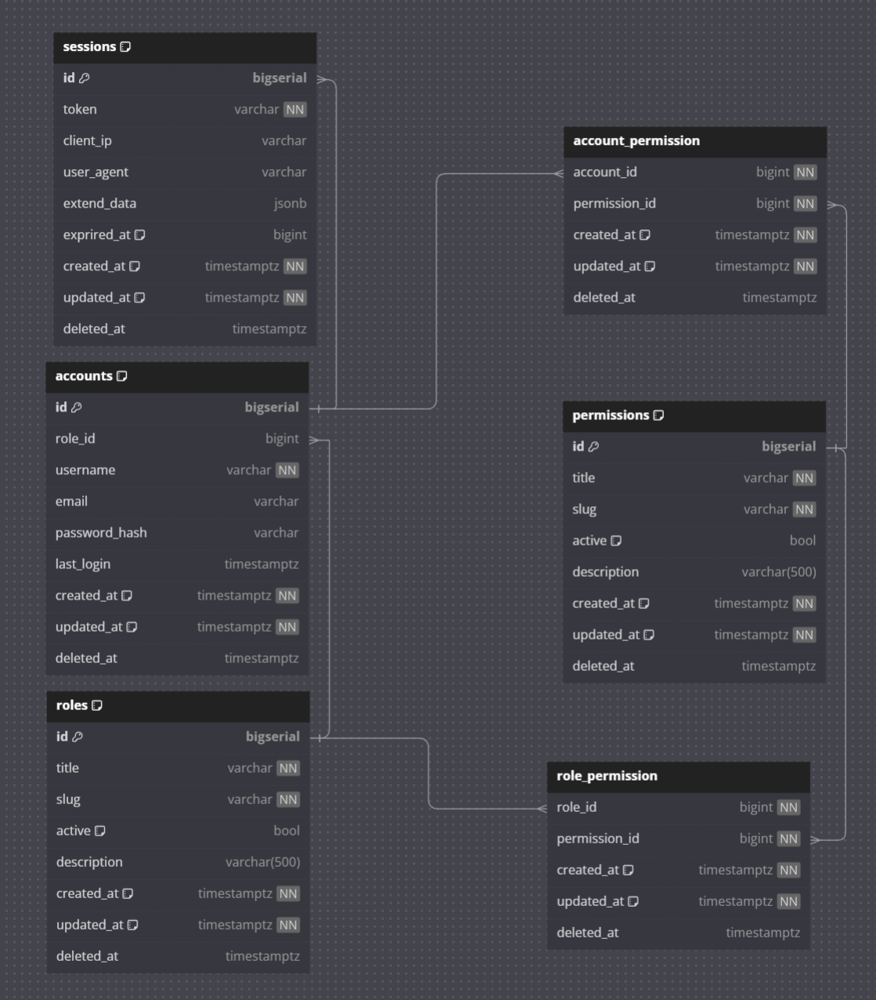

# Welcome to SSO Service

## Tools
```
go - v1.22.2
sqlc - v1.26.0
migrate - 4.17.1
```

---

## System diagram 



## Database diagram



## API design

### /register

- **Request**: username, password
- **Response**: ok or fail

### /login

- **Request**: username, password
- **Response**: id, username, email, accessToken, refreshToken

### /logout

- **Request**: accessToken, refreshToken
- **Response**: ok or fail

### /refresh-token

- **Request**: refreshToken
- **Response**: id, username, email, accessToken, refreshToken

### /account-info

- **Request**: accessToken
- **Response**: id, username, email
